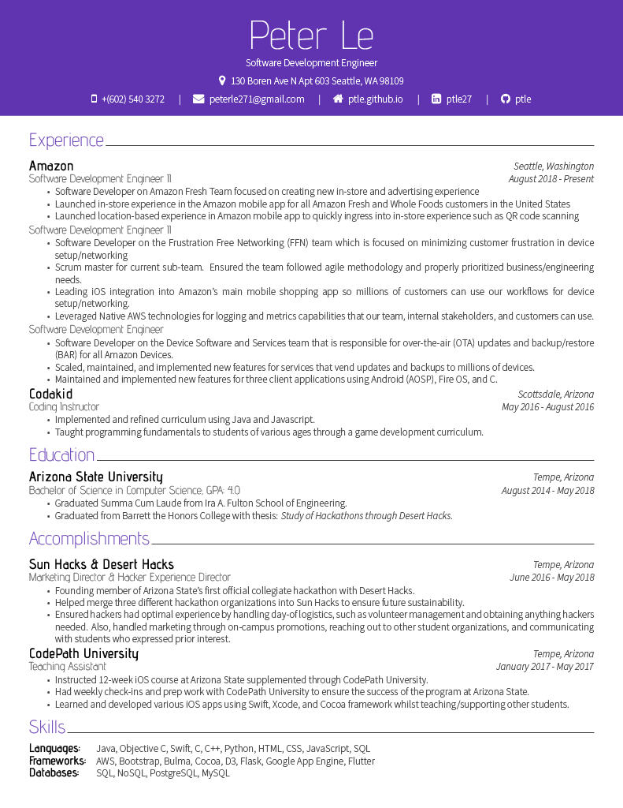

# LaTex-Resume

**LaTex-Resume** is a resume made using LaTex

## How to run:
1. Go to https://www.latex-project.org/ and download LaTex.
2. Use LaTex Editor such as TeXworks, Texmaker, ShareLaTex, or OverLeaf (suggestions).
3. Open peter-resume.tex in editor.
4. Run file using XeLaTeX.

## Preview

